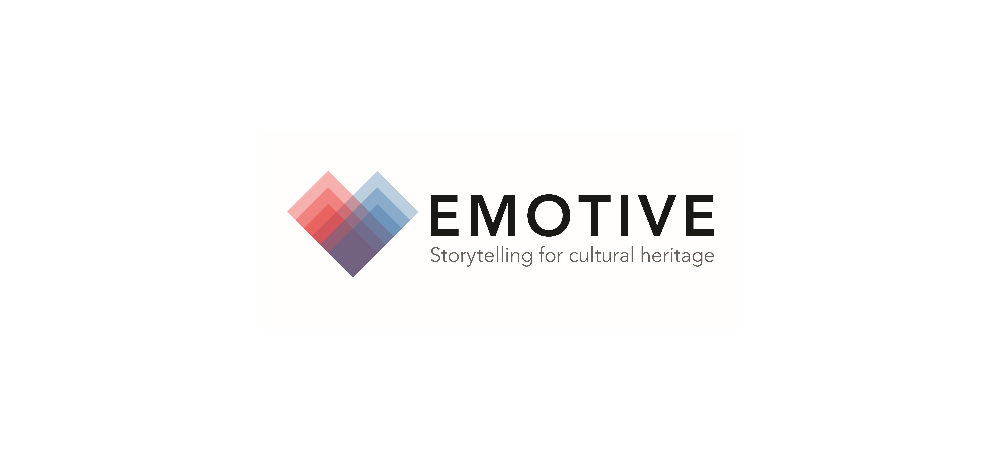

## EMOTIVE Chatbots
### A social, provocative, and affective digital tool.

This toolkit is a result of research completed by the EU-funded EMOTIVE Project. EMOTIVE believes cultural sites are highly emotional places. Regardless of age, location or state of preservation, they are seedbeds not just of knowledge, but of emotional resonance and human connection. Affective experiences containing careful reference to a site’s cultural content have the power to transform heritage and museum visitor experiences, encourage repeat visits, facilitate direct and ongoing interaction between people, and improve educational impact. 

As a form of interpretation, chatbots are an inexpensive (or free as shown here) and innovative method of reaching your visitors where they are, whether that be on your social media pages, website, or as a companion to a physical visit to site. However, we feel their true strength lies in their inherently communicative nature, as tools that prompt conversations and challenge users through active engagement.  

On this site you will find a how-to guide including a series of suggestions and technical step-by-step walkthroughs to build your own bot on SnatchBot and three distinct chatbot templates. 

[Link] (EMOTIVE_UpdatedHow-to-Guide.pdf)

[Link] (EMOTIVENestingDollModel.txt) [Link](EMOTIVEFunnelModel.txt) [Link](EMOTIVEFigure8Model.txt) 
